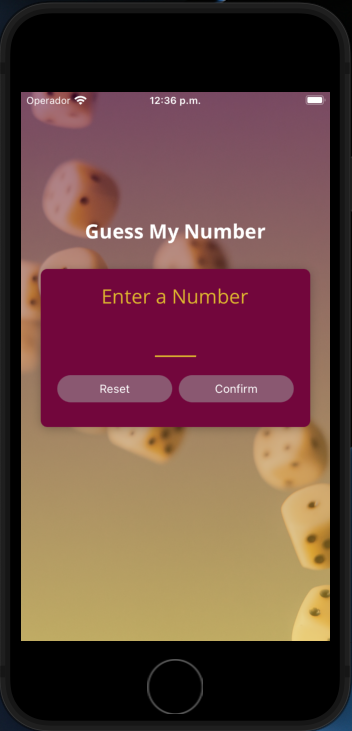
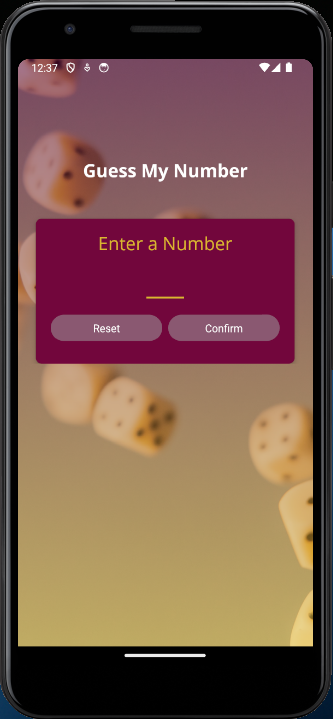
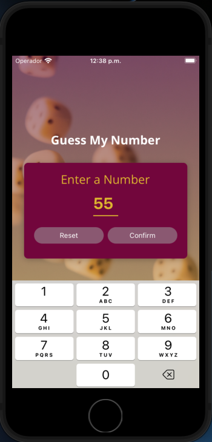
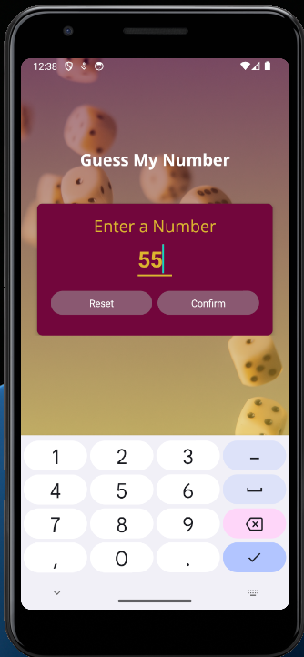
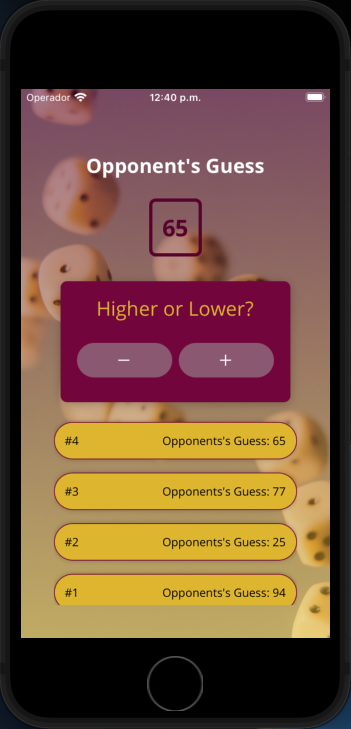
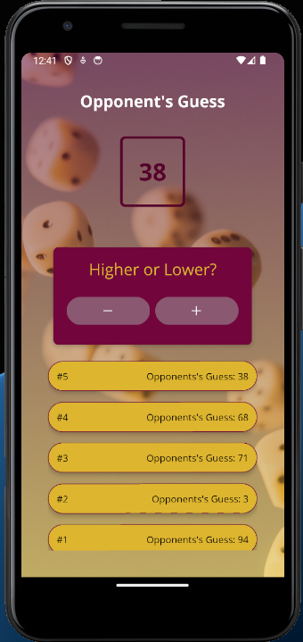

# Number Guessing Game App

Welcome to the Number Guessing Game app! This app allows you to play a fun number guessing game where you have to guess a secret number chosen by the computer. You'll be provided with hints to guide you to the correct answer. Let's get started!

## Features

- StartGameScreen: Begin the game by entering a number between 1 and 100.
- GameScreen: The computer will guess a number and you'll provide hints (higher or lower) to guide it.
- GameOverScreen: View the final result of the game and play again if you'd like.

## Screenshots

### Start Screen

iOS:  Andriod: 

### Start Screen with keyboard

iOS:  Andriod: 

### Game Screen

iOS:  Andriod: 

### Game Over Screen

iOS:  Andriod: 

## Components

### UI Components

- Card: Provides a styled card container for displaying content.
- InstructionText: Displays instruction text to guide the user.
- PrimaryButton: Represents a primary action button with customizable text.
- Title: Renders a title or heading for different sections of the app.

### Game Components

- GuessLogItem: Displays a log of guesses made by the computer during the game.
- NumberContainer: Shows the current number being guessed by the computer.

## Installation

1. Make sure you have Node.js and Expo CLI installed.
2. Clone this repository: `git clone <repository_url>`
3. Install dependencies: `npm install`
4. Run the app: `npm start`

## Technologies Used

- React Native
- Expo
- TypeScript
- Expo Fonts (for custom fonts)
- Expo Splash Screen (for a seamless launch experience)
- Expo Status Bar (for managing the status bar)

## Usage

- Custom Fonts: The app uses `expo-fonts` to load and display custom fonts for a better user experience.
- Splash Screen: The launch experience is enhanced using `expo-splash-screen`, ensuring a smooth transition.
- Status Bar: The status bar appearance is managed using `expo-status-bar`, adapting to different screens and themes.

## How to Play

1. Launch the app and start a new game.
2. Enter a number between 1 and 100 in the StartGameScreen.
3. The computer will make guesses, and you'll provide feedback whether the correct number is higher or lower.
4. Keep providing feedback until the computer guesses the correct number.
5. View the result on the GameOverScreen and choose to play again if desired.

## Credits

This app was created as a fun project to practice React Native development.

